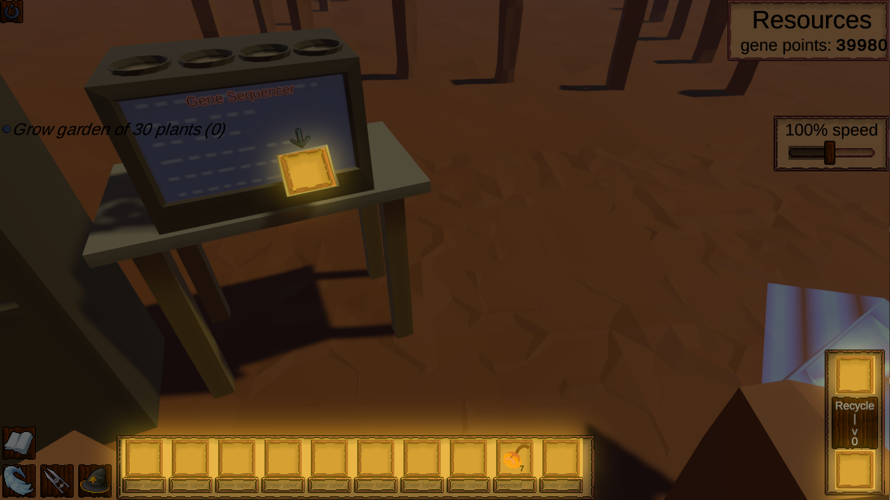

Saving game state is an important part of any game, and can get messy or cumbersome depending on how it is managed. I've designed a custom save system to isolate this difficulty, while remaining lightweight enough to handle whatever I need in the games I've been working on. I also decided to make it open source, you can get it on [OpenUpm](https://openupm.com/packages/com.dman.scene-save-system/) and [Github](https://github.com/dsmiller95/DmanUtilities/tree/master/Assets/UtilityScripts/com.dman.scene-save-system).

In this article, we'll explore how such a system is designed. In the case of Seeb Defender and other similar games, I found that serializing everything into a giant custom object quickly became awkward to work with. To illustrate this, I'd like to start with a small case study on the seeb inventory.

## Seeb Inventory

The seeb inventory covers the whole set of gameobjects which can contain Seebs, highlighted here:



These gameobjects show up in different hierarchies, but all save the same type of data. Specifically, some of the slots are in a collection (the row in the bottom left), and some are one-off slots that will never be repeated. Whatever technique we use to save this data it should be trivial to change the number of inventory slots in a collection, and as simple as possible to add new one-off slots. We may want to reward the player with an inventory slot expansion, so we'll save and load a dynamic number of inventory slots. To represent all of this in a big object, we might come up with something like this:

```CSharp
class SaveObject{
  InventorySlotSaveData geneSequencer;
  InventorySlotSaveData recyclerInput;
  InventorySlotSaveData recyclerOutput;
  InventorySlotSaveData[] inventoryBar;
}
```

To rehydrate this data, the singleton inventory slots must be custom coded to pull from their unique property. However, to get the inventory bar instantiated, we will need a manager to handle iterating over the individual inventory slots, making sure that there are the correct number of slots instantiated. This gets even more complicated if we decide that we want to save other information alongside the inventory slots, for example, custom text input by the player. With this approach, we would have to change our saved data model every time any new component is added to the inventory slot.


## A Generic Solution

With our problem case illustrated, lets think about what we can do to solve the generic case. From the example, we already have two things we want to support: specific "singleton" instances in a scene, and collections of instances nested under specific game objects. And, we would like the component which owns data to be context-agnostic. We shouldn't make any code changes to a component based on whether it is saved as a singleton instance, or reproduced as part of a collection of instances. The approach I went with was splitting the scene up into scopes, and saving the data in each scope separately.

### Scoping

Our scopes will be embedded within the game object hierarchy. When saving data, every component in a save scope must have a unique ID to map data back to the component. This would be a problem with only one scope, but when we deal with nested scopes, it becomes pretty easy to work with.

Any game object which is a direct child of the scene will be considered in the <i>scene scope</i>, and unless otherwise specified all game objects will be in the same scope as their parent. We will create new scopes whenever we have a collection of saved objects, such that every individual item in the collection has its own scope. Since each item will be an instance of a prefab, we will mark their parents as a <i>prefab parent</i>.

All children of <i>prefab parents</i> are considered to have their own scope. A prefab parent has a unique ID in its scope, but since each prefab child it has is its own scope, all of their identifiers only need to be unique to that one prefab! This means when designing a prefab such as an inventory slot, we do need to make sure components inside the prefab have unique IDs, but that's it. No need to check collision with other UI elements in the scene.

Here's an example of what the game object hierarchy of our example might look like, with all scopes colored uniquely:

- <span style="color:blue"> gene sequencer inventory slot </span>
- <span style="color:blue">recycling panel</span>

  - <span style="color:blue">recycling input inventory slot</span>
  - <span style="color:blue">recycling output inventory slot</span>
- <span style="color:blue">inventory bar <i>prefab parent</i></span>

  - <span style="color:red">inventory slot 1 <i>prefab instance</i></span>
  - <span style="color:purple">inventory slot 2 <i>prefab instance</i></span>
  - <span style="color:green">inventory slot 3 <i>prefab instance</i></span>

### Prefab Instancing

We've outlined the basics of how scoping slices our scene up into manageable chunks. This is most important part, but there are some details left. How exactly will we know what prefab to instantiate? We can use scriptable objects! We create a special scriptable object which only holds an ID, and associate instances of this with any prefab we want to be saved. When saving the prefab instance we can simply save the ID of that prefab, and to rehydrate we will look up the prefab asset by its ID before instantiating.

### Individual Save Components

Now to the actual implementation of saving individual components. We will define an interface which any component can implement to save its data:

```CSharp
public interface ISaveableData
{
    // A unique identifier inside the prefab, or inside the scene, to identify this data
    public string UniqueSaveIdentifier { get; }
    object GetSaveObject();
    void SetupFromSaveObject(object save);
}
```

Any implementing class must expose a unique identifier, often it suffices to return a constant name of the component's class. If multiple instances of the component are in the same scope however, a string text field should be exposed in the editor to be manually altered. This would benefit from an editor extension which automatically checks for colliding unique IDs, if collisions end up happening often.

The only GetSaveObject method has the component return a serializable data object to be saved by the save system. This save object will then be passed into the SetupFromSaveObject method when loading save state again. So from the component perspective, all it needs to know is how to serialize its state and how to apply that serialized state to itself again.


### Wrapping It Up

To connect all of this together, we need to think about how the actual saving and loading algorithm will work. Both will work similarly. We will iterate through the game object tree depth-first, all the while keeping track of the scope of the current game object. When we are saving, we will actually be building the scope data from nothing, as opposed to when loading which matches the existing save scope data against the game object hierarchy. Every scope will contain a dictionary mapping unique identifiers to their saved object. Saving involves taking any implementation of ISaveableData, and assigning data into the scope's dictionary: `saveScopeData[saveable.UniqueSaveIdentifier] = saveable.GetSaveObject()`. Loading is similar: `saveable.SetupFromSaveObject(saveScopeData[saveable.UniqueSaveIdentifier])` .

With this new save system setup, the work of saving objects and repeated duplicates of objects is offloaded into the hierarchies in the scene. In addition, it reinforces separation of concerns! Any system in-game can implement this interface, and no special controller/manager is required.
