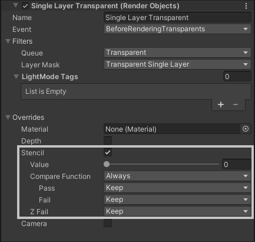
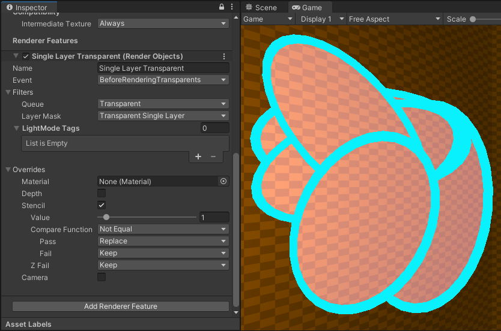

I found while working on seeb defender that we could really use a way to render a bunch of overlapping meshes as if they were one. If these were opaque meshes, this would be no problem: we could just stack them up on top of each other and call it a day. The complication here is that our meshes are transparent. Specifically, we have several flat meshes with a transparent interior and an opaque border. By default the additive transparent interior will stack up until it starts triggering our bloom effect. And the opaque border will overlap with itself and the transparent interior. We would like to only see the border on the edges of the whole overlapping region, and only see a single-layer of the transparent interior otherwise.

# Initial setup

This is the example scene we will be working with. We have one flat ellipse mesh with two submeshes, each with a different material. See the material configurations here:


# Using the Stencil buffer

To only render the infill once, we can use some stencil buffer settings. The stencil buffer is a one byte value stored for every pixel, and can be handy to mask out objects in various ways. In our case we can write a specific value to the stencil buffer when drawing either the infill or the edges material, and only draw to the render output if that specific value is <i>not</i> already present. In this way, only the first material in the render queue will actually write to the screen.

For this example we will use URP's render settings to achieve this without writing any shader code! In other project setups or game engines this may require writing a custom shader to interact with the stencil buffer. But for URP, what we need is all achievable by modifying our Universal Renderer Data asset. This is what the default setup looks like:


Lets walk through every change we need to make.

First, we create a new layer "Transparent Single Layer" to assign to our ellipses. We remove this from the transparent layer mask of the forward renderer, which prevents anything in this layer from being rendered as normal. After making only this change, none of our meshes should render at all anymore.

<Video src="./turn_off_mask.mp4" caption="Excluding the Transparent Single Layer causes it to no longer render" />

Next, we add a new render feature (Render Objects) and name it "Single Layer Transparent". We set the layer mask to only our previously excluded "Single-Layer transparent" layer, so that this feature will only render our target meshes. In addition, we put it in the Transparent queue and hook it to the BeforeRenderingTransparents event so it renders along with all other transparent objects. At this point our meshes are visible again! Although they look exactly as before, now we will be able to control their render settings directly.

<Video src="./add_render_feature.mp4" caption="By adding a render feature, we control how a specific layer renders" />

Finally it's Stencil time! We can check the stencil checkbox under overrides on our render objects feature. This override lets us configure how we want to interact with the stencil buffer. This function will compare our value to whatever is in the stencil buffer for each pixel that renders, when it renders. If the compare function is True the shader has passed the stencil test, otherwise it fails. We also specify how to modify the stencil buffer, based on if we have passed or failed the stencil test! In addition, if the stencil test does not pass then no colors will be rendered to the screen. This is similar to how the depth buffer works, but is indented for customization. For more details on how the stencil buffer works, see the [ShaderLab documentation](https://docs.unity3d.com/Manual/SL-Stencil.html)



To configure our stencil override, lets pick a value of 1. We could pick any value here, as long as its not 0 (the default value in the stencil buffer). Our pass should write this value to the stencil buffer when it is rendered, and then only render when this value has <i>not</i> already been written. To achieve this, the compare should be Not Equal, on Pass we Replace the stencil buffer with our value of 1. On Fail we Keep whatever is already in the stencil buffer. Lets leave Z-Fail as-is at Keep, in our case we do want to retain depth-ordering.



In pseudocode, this is more or less what's going on with this configuration:

```CSharp
if(stencil[pixelCoord] != 3){
  color[pixelCoord] = BlendMaterialIntoColor(color[pixelCoord]);
  stencil[pixelCoord] = 3;
}
```

And we're done! Or are we? With this configuration applied to our overlapping meshes it is true they are only rendering once to the screen. We can tell because we see no bloom effects kicking in anymore. However we still see some of the edges rendering where we want only the infill to render. This comes down to render order: by default, all meshes are ordered based on distance from the camera. We can see camera position affecting our render by moving around in our scene view:

<Video src="./moving_overlaps.mp4" caption="The meshes default rendering causes them to be ordered differently based on how we look at them" />

This effect is interesting, but it's not what we want. Fortunately there is a way to force materials to be rendered in a different order relative to each other. By modifying the Priority on our edges material we can tell the render pipeline to render our edges after rendering the infill, so they will only render on pixels which the infill did not render onto already.

<Video src="./set_material_priority.mp4" caption="By adjusting the material property of the edge, we can cause it to render and check the stencil buffer after the infill material renders" />

with a priority of 1, we complete the effect!

### In Game example

This is an animated example of what this technique was used for in seeb defender. The overlapping meshes are used to indicate the total range of each plant defense tower. Each plant has multiple weapons, each with their own unique range. Rendering all of these ranges on their own can quickly become very visually noisy, rendering them as if they were one range makes the net threat range of the tower much easier to parse.

The left side of this animation is what the ranges looked like before this technique, rendering the whole 3D range of every weapon. These 3D ranges would test the depth buffer, and render as a different color when they are close to another surface. This would help highlight the threat range of the towers, but also can be quite distracting when they overlap with each other significantly.

<Video src="./range-anim.mp4" caption="Animation comparing previous results to new improved results" />

