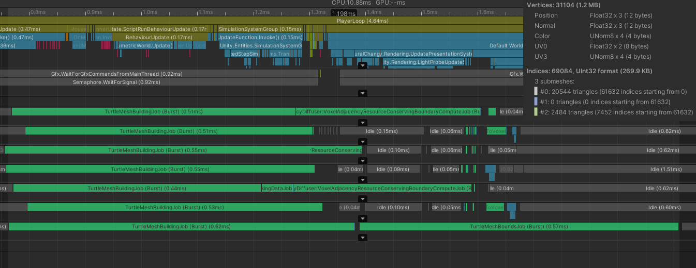

# Overview

On the road to better looking plants, I finally reached the point where its time to improve the appearance of their trunks. 

This system should have very simple inputs, to keep it flexible. The system's inputs will be a series of points forming a path for each stem, connected to each other in a tree structure. Each point will have an extra dimension attached to them indicating the thickness of the tree at that point. In addition, certain material properties may be passed on such as a pallet index or vertex color. These material properties may or may not be blended by the branch generator system, but they will definitely be passed through to the final mesh's vertexes. In this way, we are forced to design an algorithm which is highly agnostic and hopefully reusable. For example, when we have a trunk that's branching into many other stems, we cannot rely on information about which child stem is the "same" trunk. All child stems of a branching area are consider equally. This will make it easier to plug into our existing L-system.

# Library setup

I'll briefly summarize how extending the L-system library works here. If you just want to get to the generation methods, continue on to the next section!

Since we only care about turning the l-system string into a mesh, we don't need to worry about extending the l-system update step itself. All we care about is adding a new turtle operation. Unfortunately, in the interest of performance, extending the turtle's operations requires cracking open the core source code

Luckily the library has some support for this! We just need to write a new TurtleOperationSet scriptable object class, and assign an instance of it to the Turtle. Our first move is to create a new implementation of TurtleOperationSet : this is a base class for any scriptable object used to configure a set of things the turtle can do.

The current workflow to add a new type of turtle operation into the library is a little awkward. Our turtle job indexes all of its operations by a single union struct, indexed by an enum. So to extend the process, we need to add a new type to the enum, and a new union-ed data type into our turtle operation structure representing our stem operation. This diff outlines the changes made to integrate our new operation into the existing turtle system:

<details>
  <summary>Turtle execution pattern</summary>

```diff-CSharp
  public enum TurtleOperationType : byte
  {
      ADD_ORGAN,
+     ADD_STEM,
      ROTATE,
      SCALE_TRANSFORM,
  }

+   public struct TurtleStemPlacementOperation
+   {
+       public byte materialIndex;
+       public ushort radialResolution;
+       public float baseLength;
+       public float baseRadius;

+       public void Operate(
+           ref TurtleState state,
+           int indexInString,
+           SymbolString<float> sourceString,
+           ...)
+       {
+         ...
+       }
+   }

  [StructLayout(LayoutKind.Explicit)]
  public struct TurtleOperation
  {
      [FieldOffset(0)] public TurtleOperationType operationType;
+     [FieldOffset(1)] public TurtleStemPlacementOperation stemOperation;
      [FieldOffset(1)] public TurtleOrganOperation meshOperation;
      [FieldOffset(1)] public TurtleScaleOperation scaleOperation;
      [FieldOffset(1)] public TurtleRotationOperation rotationOperation;

      public void Operate(
          ref TurtleState currentState,
          int indexInString,
          SymbolString<float> sourceString,
          ...)
      {
          switch (operationType)
          {
              case TurtleOperationType.ADD_ORGAN:
                  meshOperation.Operate(ref currentState, indexInString, sourceString, ...);
                  return;
+             case TurtleOperationType.ADD_STEM:
+                 stemOperation.Operate(ref currentState, indexInString, sourceString, ...);
+                 return;
              case TurtleOperationType.ROTATE:
                  rotationOperation.Operate(ref currentState, indexInString, sourceString);
                  return;
              case TurtleOperationType.SCALE_TRANSFORM:
                  scaleOperation.Operate(ref currentState, indexInString, sourceString);
                  return;
              default:
                  return;
          }
      }
  }


  [BurstCompile]
  public struct TurtleCompilationJob : IJob
  {
      [ReadOnly]
      public SymbolString<float> symbols;
      [ReadOnly]
      public NativeHashMap<int, TurtleOperation> operationsByKey;

      public TmpNativeStack<TurtleState> nativeTurtleStack;
      public CustomRuleSymbols customRules;
      public TurtleState currentState;

      public void Execute()
      {
          for (int symbolIndex = 0; symbolIndex < symbols.Length; symbolIndex++)
          {
              var symbol = symbols[symbolIndex];
              if (symbol == customRules.branchOpenSymbol)
              {
                  nativeTurtleStack.Push(currentState);
                  continue;
              }
              if (symbol == customRules.branchCloseSymbol)
              {
                  currentState = nativeTurtleStack.Pop();
                  continue;
              }
              if (operationsByKey.TryGetValue(symbol, out var operation))
              {
                  operation.Operate(
                      ref currentState,
                      symbolIndex,
                      symbols,
                      ...);
              }
          }
      }
  }
```
</details>

With our operation included into the turtle's lifecycle, now we're free to start implementing the code and pulling information out of the turtle! If you'd like to dig into the code as it exists in the repository, you can check out all of it on its own branch here: [github folder link](https://github.com/dsmiller95/LindenmayerPlantSimulation/tree/custom-stems/Packages/com.dman.l-system/Runtime/UnityObjects/TurtleOperations/TurtleStemTrunkComposite)

# Naive approach

This is the current state of the system. To produce the illusion of a single stem, we simply copy the same cylinder mesh multiple times onto the path of the trunk. Ultimately the L-system only outputs a series of oriented points, so this is the natural way to implement stems in that system.

In our example, this looks pretty decent. There are several drawbacks to this approach though:
- Sharp edges when changing scale. At the tree's base, there are hard edged steps from one trunk diameter to another
- Sharp normals when drawing tight curves. The cylinder's normals have no way to blend with each other, so it becomes very apparent the stem is segmented when the turning radius is tight
- Breaks in stem at tight curves. When turning tightly there are visible breaks in the stem since this system has no knowledge of corners
- Seamless UV mapping is impossible. As we copy the mesh, we copy the UV coordinates as well. There's no easy way to use this technique to map a seamless bark texture onto our trunk without significant stretching and warping


import copiedCylinders from "./basic-mesh-copy.mp4";
import cylindersScronked from "./scrunkled-cylinder.mp4";
import descronkled from "./deskrunkled.mp4";
import circleRingShifted from "./circle-ring-shifted.mp4";
import basicMapBrokenWrap from "./basic-texture uv-wrap-broken.mp4";
import basicMapFixedWrap from "./basic-texture uv-wrap-fixed.mp4";
import textureBlendInitial from "./texture-blended-cylinders.mp4";


<Video src="./basic-mesh-copy.mp4" caption="The naive approach of copying many cylinders in a path" />


An easy way to expand on this is by welding the vertices of each mesh to each other.

# Welded cylinders

At this point we will abandon the idea of "copying" meshes, instead our system will dynamically generate all vertices and triangles for the trunk. Each stem segment will be replaced with only one circle of vertexes, and will draw triangles connecting to the previous stem segment to build the cylinder. The circle's orientation will come directly from the orientation used to copy the mesh, and triangles will be connected based on angle from the local y-axis. This is how that looks, compared to our previous approach. Note how the corners on the tightly curved fern fronds are much smoother:

<CompareSlider src1={copiedCylinders} src2={cylindersScronked} loop={false} />

This solves some of our problems! We no longer have sharp edges, and the normals blend nicely now that it is all in one connected mesh. No UVs yet. But, there is one problem! We have these weird scronkled regions wherever the tree branches into multiple segments. This is due to the fact that the organs' orientation actually rotate in multiple directions when splitting, this throws off the triangle linking.

## Descronkling

To visualize the base data, I rendered every stem "point" orientation as a basic axis visualizer. This comes from using the initial copy-mesh approach, and plugging in an axis indicator mesh. We can see that the orientation rotates nearly 180 degrees wherever the trunk splits:

<Video src="./orientation-visualization.mp4" caption="The local orientation of every stem segment in the plant" loop={false} />

We need to find a way to adjust our triangle indexes based on a rotational offset from the previous stem. Unfortunately, this means we must use *MATH* ! Don't worry though, most of it is handled by Matrix4x4 transformations for us. What we will do is project the y-axis of the next-segment onto the y-z plane of the previous-segment (in our coordinate system, x-axis is forward). Taking the angle between this projected vector and the y-axis vector of the previous-segment plane will give us our offset. Below is the code for this, unfortunately I don't have a good visualization for this. But I can recommend [this tool](https://www.falstad.com/dotproduct/) to help build intuition about dot-product's function.


<details>
  <summary>Offset Rotation calculation</summary>

```CSharp
/// <summary>
/// returns a value representing the rotation required to align the y axis of <paramref name="next"/> up as closely as possible to the y axis of <paramref name="parent"/>
/// </summary>
/// <param name="parent">the previous-stem orientation</param>
/// <param name="next">the next-stem orientation</param>
/// <returns>a value between -0.5 and 0.5, representing rotations about the x-axis from -180 to 180 degrees</returns>
static float GetNormalizedCircleOffset(Matrix4x4 parent, Matrix4x4 next)
{
    var parentBasisPlaneX = parent.MultiplyVector(new Vector3(0, 0, 1));
    var parentBasisPlaneY = parent.MultiplyVector(new Vector3(0, 1, 0));
    var parentBasisPlaneNormal = parent.MultiplyVector(new Vector3(1, 0, 0));

    var nextY = next.MultiplyVector(new Vector3(0, 1, 0));
    var nextYProjectedOnParentBasisPlane = ProjectOntoPlane(nextY, parentBasisPlaneX, parentBasisPlaneY);

    var angleOffset = Vector3.SignedAngle(parentBasisPlaneY, nextYProjectedOnParentBasisPlane, parentBasisPlaneNormal);
    return angleOffset / 360f;
}

static Vector3 ProjectOntoPlane(Vector3 projectionVector, Vector3 planeBasisX, Vector3 planeBasisY)
{
    var projectedX = planeBasisX * (Vector3.Dot(planeBasisX, projectionVector));
    var projectedY = planeBasisY * (Vector3.Dot(planeBasisY, projectionVector));
    return projectedX + projectedY;
}
```
</details>

With this normalized value, we can remap it to the # of vertices on our stem, and offset our triangle indexes accordingly:

```CSharp
// Add 1 to ensure the value is always positive. overflow will be handled by modulo operator when finding exact index.
var myCircleIndexOffset = (int)math.round((GetNormalizedCircleOffset(parentStem.orientation, pointTransform) + 1) * radialResolution);
```

<CompareSlider src1={cylindersScronked} src2={descronkled} loop={false} />

## Edge sliding

Much better, we've successfully descronkled our fern! There's one final touch we can improve though. The trunk becomes abruptly narrower when splitting. Currently, the first stem segment after a split is placed directly above the parent stem, so the cylinder downscales and overlaps with itself straight up. This produces the impression that the trunk first gets smaller, then splits in two. Ideally, this downscaling would also be accompanied with a movement in the new forward axis of each child stem segment, to imply that the trunk gets thinner at the same time as it splits off from the main trunk

We can fix this by offsetting all of the vertex circles by 1/2 of their length, effectively sliding the edge loops up along the mesh. Here's a comparison, it's a subtle difference but I think it helps. This also bears some benefit to the more tightly curved parts of the stem!

<CompareSlider src1={descronkled} src2={circleRingShifted} loop={false} />


# UV Mapping

Another drawback we can now address is seamless texturing! Our goal will be to wrap a seamlessly tiling texture around the trunk, and make sure it blends at least a little reasonably between stem segments and branching. The first approach we can try is wrapping the one axis of the uv map radially around the trunk. Luckily this part is pretty simple, we convert the angle to normalized coordinates in 0..1, and that's our x-coordinate! Easy... or so I thought. This approach actually requires an extra vertex in our circle mesh. Because UVs interpolate between vertexes, the very last vertex at uv `4/5` will interpolate down to the first vertex's `0/5` coordinate. So we need to break the mesh at the 0-th vertex, to make sure the uvs interpolate correctly. 

This is what we're missing without our extra vertex. Fixed mesh is on the right, improperly wrapped circle meshes on the left. It might be hard to catch, but sections of the tree on the left are blurrier and stretched due to the UVs interpolating at a higher gradient than they should be. With this issue fixed, the plant is looking pretty decent!

<CompareSlider src1={basicMapBrokenWrap} src2={basicMapFixedWrap} loop={false} />


# Texture Blending

Texture blending between different textures is something we'll want. The fresh growth tips of a tree never looks the same as the more gnarled, aged bark of the trunk, and we need to represent this smoothly!

To accomplish texture blending, we use the [Extra Vertex Data](https://github.com/dsmiller95/LindenmayerPlantSimulation/tree/master/Packages/com.dman.l-system#extra-vertex-data) l-system extension to indicate a texture-index in our shader, based on the depth of the L-system. In this case, we'll use 4 textures, each appearing less aged and more freshly grown. Here's the texture pallet itself, ordered top to bottom, left to right:


By mapping this onto our plant, we can get the thinnest stems looking much more realistically green. The texture blending shader also applies some adjustable fuzzing between adjacent textures in the map, which is why we will see spots of brown mixed in with the green.

<CompareSlider src1={basicMapFixedWrap} src2={textureBlendInitial} loop={false} />

Keen-eyed readers might recognize the new texture has no mipmaps, appearing more noisy. Those readers would be right! The shader currently accepts this texture as a texture3D with 4 z-levels to help with interpolation. But, when generating mipmaps on a texture that thin, unity will blend all of the z-levels together into an unrecognizable mess. So for now we just turn it off. To improve this the next shader version should probably use a Texure2D array and handle lerping between pallets manually.


# Performance

Since this is targeting real-time gameplay generation, any change we make must also consider how it affects performance. So, lets pull out the profiler! The meat of the new code we wrote is all inside the jobs threads, so we will compare how long the total mesh-building process takes with a mature tree. Another relevant property is the complexity of the resulting mesh. The previous method's pentagonal cylinder mesh used a total of 20 vertexes, and 16 triangles: a substantial sum compared to the new method's 6 vertexes and 10 triangles.

I selected the highest-value time for this process compared across about 10 different samples. This isn't the best way to gather info, but at least it gives us an idea of any large effects. here are the results:




Amazingly, our technique has actually decreased the time to run from 1.2ms to 0.9ms, almost 25% less time! My theory as to why is that even though we do more math per-stem-segment, this is offset by using nearly 1/4 the number of vertexes. The actual writing of data to memory isn't cheap, and the job generating our mesh bounds scales directly with vertex count. Overall, we see a 62% reduction in vertexes and a 22% reduction in triangles. This will make the resulting mesh much more performant to push onto the GPU, and to copy around in our game if we wish.

I'm very happy this solution does nothing to hamper the game speed, and in fact may speed it up slightly. I should be able to roll this out into Seeb Defender without concerns.

# Wrapping up

Overall, I consider this a great improvement over the existing system. I think there are yet many more details to consider, I'll summarize the possible next directions here:

1. Something similar to [Speed Tree's](https://docs.speedtree.com/doku.php?id=branchintersections) branch intersections would be phenomenal, but may not be practical under real-time gameplay constraints.
2. Normal blending along with uv mapping could improve smoothing at branch divisions
3. At the tree's branching points, the UVs are warped. Since we know an orientation change is happening there, this shifts the UV coordinates along with it. This is trickier to solve than the triangle matching problem, since if we simply remap the UVs for the first rotated circle we will also have to rotate the UVs for the next child circle.
4. The UVs are stretching out on the especially thin stems. This is because every stem segment wraps the whole texture's horizontal axis along its circumference, which means as the stems get thinner the texture will necessarily start compressing on itself. We'll need some way to adaptively tile or wrap textures around the stems to fix this problem.
5. Slightly unrelated to the stem generation, but revealed as a problem by this process. It would be ideal if the turtle system and this extension were completely separable. This would make the turtle system open to extension via composition, as opposed to requiring direct modification to the base library to add any new behavior.

Hopefully at some point in the future, I'll put up another post looking into at least one of these five improvements. Thanks for reading!